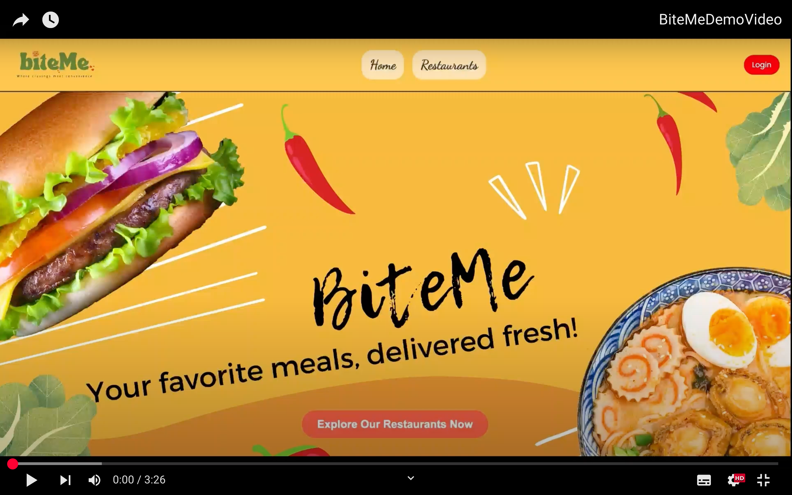

# 🍔BiteMe: Food Ordering System
---
<div align="center">
  
  <br/>
  <p><strong>A modern, microservices-based food ordering platform with AI-powered recommendations</strong></p>
</div>

---

## 📖Overview

BiteMe is a full-stack food ordering platform built with a microservices architecture that offers personalized menu recommendations using Google's Gemini AI. The system features a FastAPI backend, React frontend with Tailwind CSS, and MongoDB database, supporting different user roles (guests, authenticated users, and administrators).
The entire application is containerized with Docker, ensuring consistent development, testing, and deployment across environments while enabling seamless communication between services.

---
## 🎥 Demo Video:

👉 Watch on YouTube :

[](https://youtu.be/MCjcXWOxsag)


---

## 🌟 Key Features

- 🔐 User Authentication & Authorization
  - Secure JWT-based authentication
  - Role-based access control (guests, users, admins)
  - User profile management

- 🍽️ Restaurant Management
  - Browse restaurants by cuisine type or name
  - View detailed restaurant information with ratings
  - Admin interface for restaurant CRUD operations
  - Menu items management with customizable attributes

- 🛒 Order Processing
  - Intuitive cart system
  - Multi-restaurant ordering capability
  - Checkout process with payment simulation
  - Order history tracking

- 📱 Responsive UI
  - Modern React frontend with Tailwind CSS
  - Responsive layout that works on desktop and mobile devices
  - Real-time toasts for system notifications
    
- 🧠 AI-Powered Recommendations
  - Personalized food suggestions using Gemini AI
  - Contextual recommendations based on:
    - Order history
    - User preferences
    - Time of day
    - Menu attributes (spiciness, dietary restrictions)

---
## Architecture Diagram:


---

## 🏗️ Microservices Architecture

BiteMe follows a **microservices architecture**, separating different functionalities into individual services:

| Microservice                 | Description | Purpose                                                  |
|------------------------------|-------------|----------------------------------------------------------
| **Frontend**                 | React + Vite| User interface with responsive design                    |
| **Backend (API Server)**     | FastAPI | Core business logic, authentication, and data management |
| **Menu Recommendations Service** | FastAPI + Gemini AI | AI-driven recommendation engine |
| **Database** | MongoDB | Data persistence across services |

Each microservice is containerized and connected via **Docker Compose**.

---

## 🛠️ Technologies Used

## Backend

 - **FastAPI**: High-performance Python web framework
 - **PyMongo**: MongoDB integration for Python
 - **Pydantic**: Data validation and settings management
 - **JWT (JSON Web Tokens)**: Secure authentication
 - **Google Gemini AI API**: AI-powered recommendations

## Frontend

 - **React 19**: Modern UI library with hooks
 - **React Router**: Client-side routing
 - **Tailwind CSS**: Utility-first CSS framework
 - **Axios**: HTTP client for API requests
 - **Context API**: State management
 - **React Toastify**: Toast notifications
 - **Lucide React**: Lightweight icon library

## Database

 - **MongoDB**: NoSQL database for flexible data storage

## DevOps & Infrastructure

 - **Docker**: Application containerization
 - **Docker Compose**: Multi-container orchestration
 - **dotenv**: Environment variable management

---

## 📂 Project Structure

```plaintext
RealBiteMe/
├── backend/                         # FastAPI backend services
│   ├── app/
│   │   ├── api/                     # API endpoints
│   │   ├── core/                    # Core configurations
│   │   ├── dbConnection/            # Database connectivity
│   │   ├── models/                  # Data models
│   │   └── main.py                  # Application entry point
│   ├── static /                     # Static images
│   ├── tests /                      # Testing files
│   ├── requirements.txt             # Python dependencies
│   └── Dockerfile                   # Backend container config
│   └── generate_secret_key.py       # secret key generator           
│
├── frontend/                        # React frontend application
│   ├── src/
│   │   ├── assets/                  # Assets and images
│   │   ├── components/              # Reusable UI components
│   │   │   ├── Admin/               # Admin-specific components
│   │   │   ├── Footer/              # Page footer
│   │   │   ├── LoginPopup/          # Authentication modal
│   │   │   └── Navbar/              # Navigation bar
│   │   ├── context/                 # React contexts
│   │   │   ├── AuthContext.jsx      # Authentication state
│   │   │   └── CartContext.jsx      # Shopping cart state
│   │   ├── pages/                   # Main application pages
│   │   │   ├── Cart/                # Shopping cart page
│   │   │   ├── Home/                # Landing page
│   │   │   ├── Orders/              # Order history
│   │   │   ├── Profile/             # User profile
│   │   │   └── Restaurant/          # Restaurant listings
│   │   ├── services/                # API service integrations
│   │   ├── Api.ts                   # API service layer for backend communication
│   │   └── config.js                # Application configuration and API endpoints
│   ├── package.json                 # Frontend dependencies
│   ├── main.jsx                     # Application entry point with provider setup
│   └── Dockerfile                   # Frontend container config
│
├── menu-recommendations-service/    # AI recommendation service
│   ├── app/
│   │   ├── models.py                # Recommendation models
│   │   ├── utils.py                 # Helper functions
│   │   └── main.py                  # Service entry point
│   ├── requirements.txt             # Python dependencies
│   └── Dockerfile                   # Service container config
│
├── requirements.txt                # Python dependencies
├── docker-compose.yml              # Multi-container setup
├── .env.example                    # Environment variable template
└── README.md                       # Project documentation

```

---
## 📋 System Requirements

### Prerequisites:
- **Python 3.9+** (for FastAPI backend)
- **MongoDB** (as the database)
- **Node.js 16+** (for the frontend)
- **Docker & Docker Compose** (for containerization)
- **Pip & Virtualenv** (for Python dependency management)
- **Google AI Studio** (for Gemini API key)

---

## 🔧 Installation

### 1. Clone the Repository
```
git clone <repository-url>
cd RealBiteMe
```

**2. Create Virtual Environment:**
```
python3 -m venv venv
source venv/bin/activate  # On Windows, use `venv\Scripts\activate`
 ```
**3.Create a .env file in the project root with:**
 ```
MONGO_URI=your_mongodb_connection_string
DATABASE_NAME=your_database_name
SECRET_KEY=your_secret_key
ACCESS_TOKEN_EXPIRE_MINUTES=30
GEMINI_API_KEY=your_gemini_api_key
 ```

- Visit Google AI Studio to obtain your API key. (https://aistudio.google.com/apikey)

- Visit MongoDB atlas to create your mongo URI. (https://www.mongodb.com/)

- On the 'backend/generate_secret_key.py' you can generate a secret key by:

   - 1.Open a terminal or command prompt.
   - 2.Navigate to the folder where the script is located using cd (if necessary).
   - 3.Run the script by executing the bottom line and Copy the generated secret key from the terminal output and use it as needed:
`````
python backend/generate_secret_key.py
`````
Ensure you have Python installed on your system (version 3.x).

**Make sure the `.env` file is excluded from version control by adding it to `.gitignore`. The API key is essential for activating the menu item recommendation feature powered by Google Gemini AI.**

**4. Install Dependencies:**
   ```
pip install -r requirements.txt
 ```

**5. Run the Application using Docker Compose:**
```
docker-compose up --build
```
This will start: 

✅ Frontend (React) - http://localhost:5173

✅ Backend (FastAPI) - http://localhost:8000

✅ Menu Recommendations Service (AI-powered recommendations) - http://localhost:8001

---

## **🧬 🧪 Testing**

``` 
cd backend
pytest
```
Test Coverage:

- Unit Tests: Model validations, security functions
- Integration Tests: User authentication, restaurant management, order processing

---
## 📚 API Documentation

BiteMe offers comprehensive API documentation through Swagger UI:

 - URL: http://localhost:8000/docs
 - Features:
   - Interactive API testing
   - Request/response schema documentation
   - Authentication flow demonstration
   - Model validation details


---

## 🙌 Contributing

Contributions are welcome! Feel free to open issues or submit pull requests.

**Michelle Cain**

**Email:michellecainn@gmail.com**

---
<div align="center">
  <p>Built with ❤️ by Michelle Cain</p>
</div>
